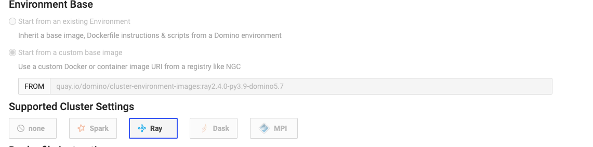

# Ray Environments

## Ray Compute Environment

This is the environment for a workspace that can connect to the Ray Cluster that can connect to the On-Demand Ray cluster
attached to the Workspace

### (Custom) Base Image  
```
quay.io/domino/compute-environment-images:ubuntu20-py3.9-r4.3-ray2.4.0-domino5.7
```

### Pluggable Workspace Tools

```shell
jupyter:
  title: "Jupyter (Python, R, Julia)"
  iconUrl: "/assets/images/workspace-logos/Jupyter.svg"
  start: [ "/opt/domino/workspaces/jupyter/start" ]
  supportedFileExtensions: [ ".ipynb" ]
  httpProxy:
    port: 8888
    rewrite: false
    internalPath: "/{{ownerUsername}}/{{projectName}}/{{sessionPathComponent}}/{{runId}}/{{#if pathToOpen}}tree/{{pathToOpen}}{{/if}}"
    requireSubdomain: false
jupyterlab:
  title: "JupyterLab"
  iconUrl: "/assets/images/workspace-logos/jupyterlab.svg"
  start: [  "/opt/domino/workspaces/jupyterlab/start" ]
  httpProxy:
    internalPath: "/{{ownerUsername}}/{{projectName}}/{{sessionPathComponent}}/{{runId}}/{{#if pathToOpen}}tree/{{pathToOpen}}{{/if}}"
    port: 8888
    rewrite: false
    requireSubdomain: false
vscode:
  title: "vscode"
  iconUrl: "/assets/images/workspace-logos/vscode.svg"
  start: [ "/opt/domino/workspaces/vscode/start" ]
  httpProxy:
    port: 8888
    requireSubdomain: false
rstudio:
  title: "RStudio"
  iconUrl: "/assets/images/workspace-logos/Rstudio.svg"
  start: [ "/opt/domino/workspaces/rstudio/start" ]
  httpProxy:
    port: 8888
    requireSubdomain: false
```

## Ray Cluster Environment


### (Custom) Base Image  
```
quay.io/domino/compute-environment-images:ubuntu20-py3.9-r4.3-ray2.4.0-domino5.7
```
In the "Supported Cluster Settings" select Ray



## GPU Support
Add the following to the `Dockerfile` instruction set for both compute and cluster environment definitions where GPU
support is needed

````shell
USER root
RUN pip install torchmetrics 
RUN pip install pytorch_lightning 
RUN pip install install lightning-bolts 

#FROM quay.io/domino/compute-environment-images:ubuntu20-py3.9-r4.3-domino5.7-standard

ARG DEBIAN_FRONTEND=noninteractive

#######################################################
#         Install CUDA and GPU dependencies           #
#######################################################
# Based off https://gitlab.com/nvidia/container-images/cuda/-/tree/master/dist/11.7.0/ubuntu2004

# Install CUDA Base
ENV NVARCH x86_64

ENV NVIDIA_REQUIRE_CUDA "cuda>=11.7 brand=tesla,driver>=450,driver<451 brand=tesla,driver>=470,driver<471 brand=unknown,driver>=470,driver<471 brand=nvidia,driver>=470,driver<471 brand=nvidiartx,driver>=470,driver<471 brand=geforce,driver>=470,driver<471 brand=geforcertx,driver>=470,driver<471 brand=quadro,driver>=470,driver<471 brand=quadrortx,driver>=470,driver<471 brand=titan,driver>=470,driver<471 brand=titanrtx,driver>=470,driver<471 brand=tesla,driver>=510,driver<511 brand=unknown,driver>=510,driver<511 brand=nvidia,driver>=510,driver<511 brand=nvidiartx,driver>=510,driver<511 brand=quadro,driver>=510,driver<511 brand=quadrortx,driver>=510,driver<511 brand=titan,driver>=510,driver<511 brand=titanrtx,driver>=510,driver<511 brand=geforce,driver>=510,driver<511 brand=geforcertx,driver>=510,driver<511"
ENV NV_CUDA_CUDART_VERSION 11.7.60-1
ENV NV_CUDA_COMPAT_PACKAGE cuda-compat-11-7

RUN curl -sS https://dl.yarnpkg.com/debian/pubkey.gpg | sudo apt-key add - && \
    echo "deb https://dl.yarnpkg.com/debian/ stable main" | sudo tee /etc/apt/sources.list.d/yarn.list && \
    apt-get update && apt-get install -y --no-install-recommends \
    gnupg2 curl ca-certificates && \
    curl -fsSL https://developer.download.nvidia.com/compute/cuda/repos/ubuntu2004/${NVARCH}/3bf863cc.pub | apt-key add - && \
    echo "deb https://developer.download.nvidia.com/compute/cuda/repos/ubuntu2004/${NVARCH} /" > /etc/apt/sources.list.d/cuda.list && \
    apt-get purge --autoremove -y curl \
    && rm -rf /var/lib/apt/lists/*

ENV CUDA_VERSION 11.7.0

# For libraries in the cuda-compat-* package: https://docs.nvidia.com/cuda/eula/index.html#attachment-a
RUN apt-get update && apt-get install -y --no-install-recommends \
    cuda-cudart-11-7=${NV_CUDA_CUDART_VERSION} \
    ${NV_CUDA_COMPAT_PACKAGE} \
    && rm -rf /var/lib/apt/lists/*

# Required for nvidia-docker v1
RUN echo "/usr/local/nvidia/lib" >> /etc/ld.so.conf.d/nvidia.conf \
    && echo "/usr/local/nvidia/lib64" >> /etc/ld.so.conf.d/nvidia.conf

ENV PATH /usr/local/nvidia/bin:/usr/local/cuda/bin:${PATH}
ENV LD_LIBRARY_PATH /usr/local/nvidia/lib:/usr/local/nvidia/lib64


# nvidia-container-runtime
ENV NVIDIA_VISIBLE_DEVICES all
ENV NVIDIA_DRIVER_CAPABILITIES compute,utility


# CUDANN8
ENV NV_CUDNN_VERSION 8.5.0.96
ENV NV_CUDNN_PACKAGE_NAME "libcudnn8"

ENV NV_CUDNN_PACKAGE "libcudnn8=$NV_CUDNN_VERSION-1+cuda11.7"
ENV NV_CUDNN_PACKAGE_DEV "libcudnn8-dev=$NV_CUDNN_VERSION-1+cuda11.7"


RUN apt-get update && apt-get install -y --no-install-recommends \
    ${NV_CUDNN_PACKAGE} \
    && apt-mark hold ${NV_CUDNN_PACKAGE_NAME} \
    && rm -rf /var/lib/apt/lists/*


# Install CUDA Runtime
ENV NV_CUDA_LIB_VERSION 11.7.0-1
ENV NV_NVTX_VERSION 11.7.50-1
ENV NV_LIBNPP_VERSION 11.7.3.21-1
ENV NV_LIBNPP_PACKAGE libnpp-11-7=${NV_LIBNPP_VERSION}
ENV NV_LIBCUSPARSE_VERSION 11.7.3.50-1

ENV NV_LIBCUBLAS_PACKAGE_NAME libcublas-11-7
ENV NV_LIBCUBLAS_VERSION 11.10.1.25-1
ENV NV_LIBCUBLAS_PACKAGE ${NV_LIBCUBLAS_PACKAGE_NAME}=${NV_LIBCUBLAS_VERSION}

ENV NV_LIBNCCL_PACKAGE_NAME libnccl2
ENV NV_LIBNCCL_PACKAGE_VERSION 2.13.4-1
ENV NCCL_VERSION 2.13.4-1
ENV NV_LIBNCCL_PACKAGE ${NV_LIBNCCL_PACKAGE_NAME}=${NV_LIBNCCL_PACKAGE_VERSION}+cuda11.7

RUN apt-get update && apt-get install -y --no-install-recommends \
    cuda-libraries-11-7=${NV_CUDA_LIB_VERSION} \
    ${NV_LIBNPP_PACKAGE} \
    cuda-nvtx-11-7=${NV_NVTX_VERSION} \
    libcusparse-11-7=${NV_LIBCUSPARSE_VERSION} \
    ${NV_LIBCUBLAS_PACKAGE} \
    ${NV_LIBNCCL_PACKAGE} \
    && rm -rf /var/lib/apt/lists/*

# Keep apt from auto upgrading the cublas and nccl packages. See https://gitlab.com/nvidia/container-images/cuda/-/issues/88
RUN apt-mark hold ${NV_LIBCUBLAS_PACKAGE_NAME} ${NV_LIBNCCL_PACKAGE_NAME}

# Install Tensorflow
RUN pip install tensorflow --user

# Install Jupyter-ai 
RUN pip install 'jupyter-ai>=1.0,<2.0' --user


#python libraries
RUN pip install pytorch-lightning
RUN pip install torchmetrics
RUN pip install pytorch-lightning-bolts
RUN pip install git+https://github.com/PytorchLightning/lightning-bolts.git@master --upgrade
RUN pip install torchvision
RUN pip install GPUtil
RUN pip install torch torchvision tensortrade
#RUN pip install wandb
RUN pip install tblib
RUN pip install pandas==1.4.1
RUN pip install nvidia-ml-py3
USER ubuntu
````
