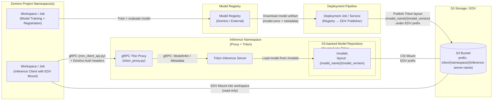

# Architecture Overview


This system provides a secure, Domino-native way to serve multi-modal models using NVIDIA Triton Inference Server behind 
a custom gRPC thin proxy. The proxy enforces authentication and isolates Triton behind strict network boundaries, 
while Domino workloads interact with it using a lightweight, typed client library
(`mm_client_api.py`). The result is a fully controlled inference path where compute, access, and data flow are 
governed explicitly.

At a high level:

1. **A gRPC Proxy + Triton Server are deployed together in a dedicated Kubernetes namespace.**
The proxy is the only component exposed to external callers. It performs Domino API-key or JWT-based authentication, validates headers, constructs Triton ModelInferRequests, forwards inference requests, and streams responses back to the workload.

2. **NetworkPolicies enforce a one-way trust boundary.**
Only the proxy may communicate with Triton. No Domino workload, pod, or external service can reach Triton directly — the proxy becomes the single enforcement point for authentication, routing, and model access control.

3. **Domino workloads perform inference exclusively via gRPC calls to the proxy.**
They never talk to Triton directly. A dedicated client library (`mm_client_api.py`) wraps gRPC details, builds protobuf packets, handles authentication headers, and streams raw tensor bytes to the proxy. This supports both batch and frame-level inference while keeping all packets stateless and self-contained.

The system is designed to be:

- **Stateless**: Each inference request is atomic and self-contained, enabling scalable, multi-client concurrency.

- **Secure**: Authentication lives at the proxy, and Triton is never exposed. NetworkPolicies isolate traffic.

- **Predictable**: The client/proxy treat each frame as an independent, batch-1 request. Triton may still batch and queue internally, but that behavior is fully encapsulated on the server side.

- **Flexible**: Any model supported by Triton (ONNX, TensorRT, PyTorch, etc.) is deployable without rebuilding the proxy.

- **Domino-native**: All Domino authentication modes (API key / JWT) propagate automatically through the gRPC stack.

The combined architecture ensures that inference on Domino is fast, secure, auditable, and fully compatible with standard Triton model repositories.




## Deployment Model (Helm Chart)

This system is deployed as a Helm chart that owns the full inference surface in a dedicated Kubernetes namespace. 
The chart installs both the  Thin Proxy and the Triton Inference Server, wires them to an S3-backed model 
repository, and exposes a single gRPC entrypoint to Domino workloads.

### Components deployed by Helm

Details of installation can be found in this [README_HELM_INSTALL.md](./README_HELM_INSTALL.md)

The Helm chart deploys the following components into a dedicated namespace:

1. **Namespace** (this is precreated and labeled. See install [docs](./README_HELM_INSTALL.md))

   - A dedicated namespace (e.g. triton-inference-dev) hosts:
     - The Triton Inference Server deployment
     - The gRPC Thin Proxy deployment
     - Their associated Services, PVCs, and NetworkPolicies

2. **S3-backed model repository (CSI + PVC)**
   - An S3 bucket is mounted into the Triton pod using the S3 CSI driver.
   - The repository path follows a strict convention:
     - S3 prefix:
     triton/{namespace}/{inference-server-name}/models
     - Triton model layout under that prefix:
       Ex. {model_name}/{model_version}/model.onnx
   - The chart typically creates:
     - A PersistentVolume and PersistentVolumeClaim backed by S3
     - A volumeMount on the Triton container at /models

3. **Triton Inference Server Deployment**
   - Runs Triton in MODE_POLL against /models:
     - `--model-repository=/models`
     - `--model-control-mode=poll`
     - `--repository-poll-secs=30`
 
   - Uses the S3-backed PVC:
     - volumeMounts: `/models` → PV → S3 prefix `triton/{namespace}/{inference-server-name}/models`
   - Exposes:
     - HTTP: :8000
     - gRPC: :8001
     - Metrics: :8002
   - Typically runs CPU-only in dev (KIND_CPU), GPU in production (KIND_GPU + nvidia.com/gpu).

4. **gRPC Thin Proxy Deployment**
   - A separate deployment in the same namespace.
   - Env/config:
     - TRITON_URL=`<triton-service-name>:8001`
     - DOMINO_HOST=http://nucleus-frontend.domino-platform:80
   - Listens on:
     - `:50051` for gRPC (`MultimodalService/Chat`, `SendUnary`)

   - Performs:
     - Domino auth via /v4/auth/principal
     - Shape/dtype validation
     - Forwarding to Triton via tritonclient.grpc

5. **Services**
   - Triton Service
     - Cluster-internal, no external access from Domino workloads.
     - DNS name (example): `triton-inference-server.<namespace>.svc.cluster.local:8001`
   - Proxy Service
     - Cluster-internal, reachable from Domino compute namespaces.
     - DNS name (example): `triton-inference-server-proxy.<inference-namespace>.svc.cluster.local:50051`
6. **NetworkPolicies**
  - A NetworkPolicy in the inference namespace enforces:
    - Allowed: Proxy → Triton (gRPC/HTTP/metrics as needed)
    - Blocked: Any other pod (including Domino workloads) → Triton
  - Domino workloads can only reach:
    - The proxy Service, never Triton directly.

### EDV / Shared Mount into Domino Workspaces

1. An External Data Volume (EDV) is configured in Domino:
    - Backed by the same S3 bucket.
    - Using the same prefix convention:
    `triton/{namespace}/{inference-server-name}/models`
    - Exposed read-write to users who need to deploy models from Domino.

2. Selected Domino Workspaces/Jobs based on whether the user has access to the EDV:
   - Mount the EDV at a stable path (e.g. /domino/edv/{edv-name}).
   - Is effectively `triton/{namespace}/{inference-server-name}/models` same as what Triton sees in `/models`
   - Can verify config.pbtxt, inspect ONNX files, and run local test clients using the exact bits served by Triton.


### Deployment Flow (Train → Registry → EDV → Triton)

The typical deployment workflow looks like:

1. **Train & register**
   - A Domino Workspace/Job trains a model and publishes it to the Domino Model Registry. The model artifact includes:
     - Model binaries (For example, `model.onnx`  the ONNX model file)
     - Triton model config (`config.pbtxt`)
     
2. **Registry → EDV publisher**
   - A separate deployment job (or CI pipeline) downloads the registered model artifact (e.g. `model.onnx`, `config.pbtxt`) and writes it into S3 under:
     - `s3://{bucket}/triton/{namespace}/{inference-server-name}/models/{model_name}/{model_version}/`
   - This is the deployment step: putting artifacts into the Triton-compatible layout.
3. **Triton sync**
   - Triton periodically polls /models (the S3-backed mount) and:
     - Discovers new `{model_name}/{model_version}` folders.
     - Loads or reloads models based on changes
4. **Inference from Domino**
   - Domino Workspaces/Jobs:
     - Mount the same EDV (for inspection/testing).
     - Use `mm_client_api.py` to send gRPC requests to the proxy Service.
     - The proxy authenticates, forwards to Triton, and returns outputs.

This deployment model decouples model training, registry, artifact publishing, and serving, while keeping the serving 
path locked down to a single, authenticated proxy and a single, S3-backed model repository.


## Client Workflow

Domino workloads never talk to Triton directly—they always interact with the gRPC Thin Proxy using the Python client library `mm_client_api.py`. The client sends raw tensor bytes accompanied by a Control message that specifies model metadata, shapes, and dtype. This design keeps the client simple while the proxy handles authentication, validation, and forwarding to Triton.

### 1. Where the Client Runs
Clients typically run inside:
- A Domino Workspace (interactive testing)
- A Domino Job/App (batch or online inference)

Optionally, the External Data Volume (EDV) is mounted so users can inspect the same models served by Triton.

### 2. Configure Proxy and Model Settings
Each client needs:
- Proxy endpoint inside the cluster (e.g. `grpc-domino-triton-proxy.<ns>.svc.cluster.local:50051`)
- Model metadata:
  - `model_name`, `model_version`
  - `input_name`, `shape`, `dtype_enum`
  - Output tensor names

These can be provided via environment variables or passed directly to `TritonBytesStreamer`.

### 3. Authenticated gRPC Channel
The client attaches Domino-style authentication headers:
- `x-domino-api-key` if `DOMINO_USER_API_KEY` is set
- `authorization: Bearer <token>` if `Authorization` is set

The proxy validates these via Domino’s `/v4/auth/principal` API before processing inference.

### 4. Per-Frame Request Construction
For each tensor:
1. Wrap raw bytes in a `Tensor` proto.
2. Build a `Control` block (model, version, inputs, outputs).
3. Construct a `DataPacket` with a unique correlation ID.
4. Send it over the `Chat` streaming RPC.

Each packet is independent—no client-side batching or session state.

### 5. Streaming Call and Responses
The main API:

```python
for seq, ack_msg, outputs in streamer.stream_bytes(
    model_name,
    model_version,
    frame_bytes_iter=my_tensor_bytes_iter(),
):
    ...
```

Each iteration returns:
- `seq`: sample index
- `ack_msg`: parsed JSON with backend, CID, model, outputs or errors
- `outputs`: decoded NumPy arrays (if enabled)

### 6. Error Handling
If Triton or the proxy encounters an issue:
- An `Ack` with `status != OK` is returned
- `ack_msg` contains `{ "error": "<reason>" }`

No silent failures: missing models, shape mismatches, or Triton errors are explicit.

### 7. Typical End-to-End Pattern
1. Mount EDV in workspace for inspection.
2. Load or preprocess frames into tensors.
3. Use `TritonBytesStreamer` to send tensors to the proxy.
4. Receive validated outputs or error acks.
5. Postprocess (JSONL, annotated video, arrays).

This workflow cleanly separates client logic from Triton inference details, while preserving full visibility and authentication control.

## Security Model

This design assumes that Triton and the proxy live in a locked-down inference namespace, and Domino workloads are the only tenants allowed to talk to them.

### 1. Authentication (Domino → Proxy)

   - All gRPC calls from Domino workloads to the proxy carry Domino-style credentials:

        - `x-domino-api-key` (from DOMINO_USER_API_KEY)
        - or `authorization`: Bearer <jwt> (from Authorization)

    - The proxy’s DominoAuthInterceptor validates each call by hitting `DOMINO_HOST/v4/auth/principal`.

    - If the call is not `200 OK`, the RPC is rejected with `UNAUTHENTICATED` (or `UNAVAILABLE` for upstream errors).

### 2. Authorization (who can call what)

   - Network: Kubernetes NetworkPolicy only allows:
     - Domino workload pods → proxy service
     - proxy → Triton gRPC service
       There is no direct path from Domino workloads to Triton. 
   - Domino-level access:
     - Only approved users get the EDV mount that points to `triton/{namespace}/{inference-server-name}/models`
     
   - Proxy-level scope:
     - Proxy doesn’t implement per-model RBAC; it enforces “is this caller a valid Domino principal?”.


## Failure Modes

This section describes what happens when things go wrong and how failures surface to users.

### 1. Triton model not loaded / wrong version
   - Cause:
     - `config.pbtxt` mismatch with ONNX output shape.
     - Requested `model_version` not present or failed to load.
   - Behavior:
     - Triton returns an error (e.g., “failed to load model…”) to the proxy.
     - Proxy returns Ack with:
       - status = INTERNAL (or BAD_REQUEST for obvious control issues)
       - message JSON containing "error": "<triton error text>".
    - Client effect:
      - `mm_client_api.TritonBytesStreamer` still yields (seq, msg, decoded=None).
      - `msg.get("error")` is non-empty, and outputs is absent or empty.

### 2. Proxy rejects the request (auth / control / tensor issues)
Common cases:

   - Missing or invalid Domino credentials → `UNAUTHENTICATED`.
   - No Control block → `status = BAD_REQUEST`, error "missing control...".

   - Missing model / model_version / inputs / outputs → `BAD_REQUEST`.

   - Tensor shape/dtype mismatch vs Control → `BAD_REQUEST` with explicit mismatch message.

   - Unsupported from source (anything but `SRC_TENSOR`) → `UNSUPPORTED`.

In each case, the proxy does not call Triton and returns an Ack with an error JSON.

### 3. Network or infrastructure failures

- Proxy pod down:
  - gRPC connection from client fails (UNAVAILABLE, connection refused).
  - No Ack is delivered; the client sees a gRPC exception rather than a structured Ack.

- Triton pod down or restarting:
  - Proxy’s InferenceServerClient raises InferenceServerException.
  - Proxy maps this to Ack with status = INTERNAL and a "backend": "triton", "error": "...".

- S3 CSI / mount failures:
  - Triton’s /models mount doesn’t come up → model load fails.
  - Triton logs show “could not open model directory”; proxy errors whenever a request hits a non-READY model.

### 4. Slow or overloaded Triton

- Heavy CPU load, slow ONNX Runtime, or large batches:
  - Triton still processes requests but with higher latency.
  - `Ack.timing` (from the proxy) shows increased `triton_infer_ms` and `total_ms`.

- If Triton crosses request timeout:
  - Proxy’s client call hits the configured timeout (`Control.timeout_secs`).
  - Returns Ack with `status = INTERNAL` and an error noting the timeout.

### 5. Client-side misconfiguration

- Wrong `INPUT_SHAPE / INPUT_DTYPE` in `mm_client.py`:
  - Proxy detects byte-count mismatch vs shape/dtype:
    - "size mismatch: got X bytes, expected Y..." in error JSON.
- Wrong `OUTPUT_NAMES`:
  - Triton returns outputs, but proxy marks missing ones as `{ "error": "missing" }`.
  - Client sees empty or partial out_arrays.

## Performance Considerations

This design aims to be predictable and debuggable rather than hyper-optimized out of the box. There are a few key tuning knobs:
### 1. Triton batching and throughput

   - `max_batch_size: 16` in `config.pbtxt` means Triton can batch requests internally.
   - Current client behavior:
     - `TritonBytesStreamer` sends one frame per request (effectively batch size = 1 at the API layer).
   - Triton may still do minor batching/queueing under the hood depending on scheduler config.
   - If higher throughput is needed:
     - Change the client to group frames into (N, 3, 640, 640) batches.
     - Enable/adjust dynamic_batching in Triton’s config.pbtxt for yolov8n.

### 2. Proxy overhead and scaling

   - The proxy is intentionally thin:
     - No pre/post processing, just auth + validation + forward.
     - CPU cost per request is small (JSON packing, base64, basic shape checks).

   - Scaling patterns:
     - `proxy` Deployment can be scaled horizontally (`replicas > 1`) behind a ClusterIP or Ingress.
     - Triton can also be scaled (multiple instances of the same model, or separate Deployments for hot vs cold models).

   - For very high frame rates:
     - Prefer persistent gRPC streams (multiple DataPackets per Chat call) instead of “one tiny stream per frame”.
     - This trades code simplicity for lower per-frame overhead.

### 3. CPU-only ONNX Runtime

   - The current config uses onnxruntime on CPU:
     - Good enough for demos and moderate workloads.
     - Latency is bounded by CPU core count and clock; expect tens of ms per frame rather than single-digit ms.

    - For production:
      - Switch to GPU-backed Triton images and GPU instance groups.
      - Ensure instance_group uses KIND_GPU and set resources requests/limits accordingly.

### 4. Model repository and S3 mount performance

   - Models are served from /models, backed by S3 via CSI:
     - First access to a large model may incur cold-read / cache penalties.   

### 5. Client-side efficiency

   - `mm_client.py`:
     - Uses contiguous FP32 NCHW tensors and tobytes(order="C") to avoid unnecessary copies.
     - Preprocessing (letterbox + resize + color conversion) is often more expensive than the proxy hop; optimizing this (e.g., vectorized ops, GPU preprocessing) has big wins.

   - Output decoding:
     - `parse_outputs_numpy=True` does base64 decode + shape cast.
     - For very high throughput, you can:
       - Keep `parse_outputs_numpy=False` and only decode downstream when necessary.
       
### 6. Latency vs utilization trade-offs

   - Low latency:
     - Batch size 1, no dynamic batching, more Triton instances.
     - Network policies and proxy add microseconds–milliseconds, but main cost is model inference.

   - High utilization:
     - Enable batching and accept a small amount of queueing in Triton.
     - Increase `max_batch_size`, `tune dynamic_batching` to match request patterns.

## Next steps

1. Create a separate service 
   - With permission to scale deployments in the namespace of that service
   - Update the resources limits and request for the a deployment container in this namepace  
2. Specific roles (defined in keycloak) will be given permission to scale the triton inference server.

3. Add prometheus monitoring to the triton server and proxy to guide sizing of infra
 

## Discussion Points

1. Should we fix the name of the inference server? We stick to one per namespace. 
   I prefer the later because it is simpler. We could follow naming conventions like
  `inference-dev-{name}`. Basically `inference-{env}-{name}`
2. Currently all models are accessbile to all authenticated users. Should we drive this from Keycloak claims/roles?
3. Currently we only expose gRPC. But should we expose REST to Triton too? Any model using GPU (LLM) could use GPU